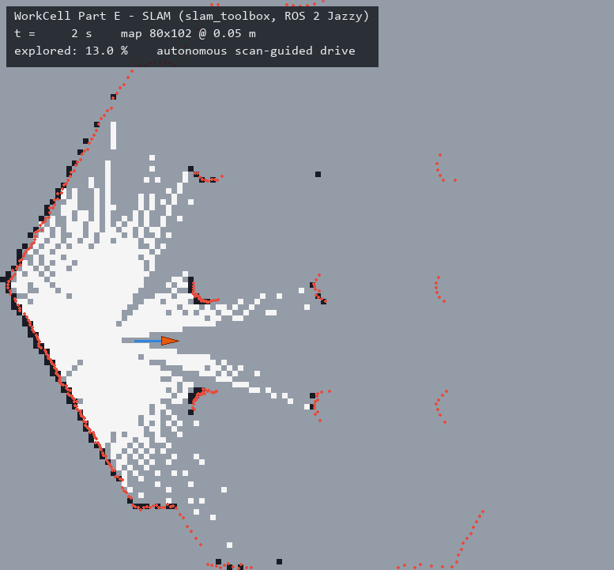
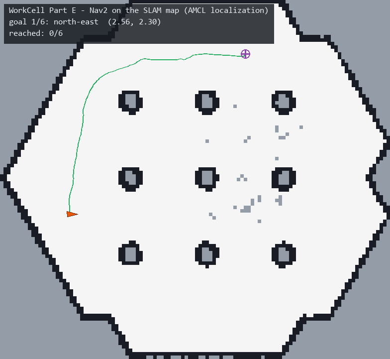

# WorkCell Part E — CellOps: the work-cell meets ROS 2

> **Part E of the _WorkCell_ series** — one simulated industrial work-cell, five learning approaches:
> [A · imitation](https://github.com/ahmedsohail2003/workcell-partA-imitation) ·
> [B · VLA](https://github.com/ahmedsohail2003/workcell-partB-vla) ·
> [C · grasping](https://github.com/ahmedsohail2003/workcell-partC-grasping) ·
> [D · RL + world model](https://github.com/ahmedsohail2003/workcell-partD-rl) ·
> E · ROS 2 (this repo) ·
> [datasets & models on 🤗](https://huggingface.co/ahmedsohail2003) ·
> **[🌐 portfolio overview](https://ahmedsohail2003.github.io/)** — the whole series on one page

**ROS 2 Jazzy on WSL2: TurtleBot3 SLAM (`slam_toolbox`) → Nav2 autonomous
navigation, fully scripted end-to-end — plus a C++ port of Part C's 6-DoF
grasp-pose estimator served over ROS 2, numerically identical to the Python
reference and 3.3× faster.**

Parts A–D live inside one MuJoCo work-cell; a real factory deployment runs on
ROS. Part E closes that gap twice over: the **mobile half** (SLAM + Nav2 — the
material-transport layer that moves parts between cells) and the **systems
half** (`rclcpp`, a service interface, colcon, and an honest C++-vs-Python
benchmark of real perception code).

| | |
|---|---|
|  |  |
| *slam_toolbox builds the map while a reactive `/scan`-guided driver explores autonomously* | *Nav2 + AMCL on the finished map: 6/6 goals, twice (12/12 total)* |

*(Demo GIFs are rendered offline from recorded `/map`, `/tf`, `/scan`, `/plan`
streams — see [Recording demos without a screen](#recording-demos-without-a-screen).)*

## Results

| Experiment | Result |
|---|---|
| SLAM map (240 s autonomous exploration) | 112×103 cells @ 5 cm; 67.3 % free / 7.1 % occupied; walls closed, all 9 obstacle cylinders resolved |
| Nav2 goal-to-goal (map-derived goals, AMCL) | **6/6 SUCCEEDED** per run, **12/12 across two independent runs** (13–50 s per goal, incl. return-home) |
| C++ pose estimator vs Python reference | **0.000 mm / 0.000° disagreement** on all 12 clouds; ground-truth error identical (0.45 mm mean) |
| C++ pose estimator speed | median solve **14.0 ms → 4.33 ms (3.3×)**, single-threaded, no PCL ([full table](results/grasp_benchmark.md)) |
| ROS 2 service round-trip (`PointCloud2` in → pose out) | sub-mm estimates in 3.7–5.8 ms solve time per call |

## What's here

```
cellops/
├── scripts/
│   ├── wsl_setup.sh              # one-shot provisioning: ROS 2 Jazzy + Gazebo Harmonic + TB3 + Nav2
│   ├── headless_world.launch.py  # TB3 world minus the Gazebo GUI (the GUI segfaults under WSLg)
│   ├── run_mapping.sh            # world -> slam_toolbox -> autonomous drive -> save + verify map
│   ├── explore_drive.py          # reactive /scan-guided exploration (TwistStamped!) + freeze watchdog
│   ├── run_nav2.sh               # world -> Nav2 on saved map -> seed AMCL -> goal sequence -> success rate
│   ├── pick_goals.py             # derive nav goals from the map itself (clearance transform)
│   ├── record_run.py / render_gif.py   # demo GIFs from recorded topic streams, no screen capture
│   ├── make_testdata.py          # export segmented clouds through Part C's real perception pipeline
│   ├── python_ref.py / parity_report.py # benchmark: original pose.py vs the C++ port
│   └── lib_common.sh             # safe_pkill, wall-clock topic waits, launch-with-retry
├── ros2_ws/src/
│   ├── cellops_interfaces/       # EstimateCubePose.srv (PointCloud2 + table plane -> grasp pose)
│   └── cellops_grasp/            # C++: from-scratch KD-tree, Eigen Kabsch/ICP, rclcpp service, benchmark
├── maps/ · media/ · results/     # saved map, demo GIFs, benchmark tables + nav CSVs
└── docs/BUILD_LOG.md             # chronological engineering log (all 9 silent-failure modes)
```

## The C++ artifact (Part C's estimator, ported and served)

[Part C](https://github.com/ahmedsohail2003/workcell-partC-grasping) estimates
a table-resting cube's 6-DoF pose with a coarse yaw sweep + table-constrained
trimmed ICP (2-D Kabsch increments, scipy `cKDTree` correspondences). This repo
ports it to C++ ([cube_pose.cpp](ros2_ws/src/cellops_grasp/src/cube_pose.cpp))
with numpy's semantics replicated to the decimal — `arange` endpoint behaviour,
`int()`-truncated trim counts, `np.quantile` interpolation, non-negative
modulo — so the two implementations can be compared point-for-point:

- **Parity**: 0.000 mm / 0.000° mean disagreement across 12 clouds exported
  through the real Part C pipeline (the residual is ~1e-7 mm — float rounding).
- **Speed**: 14.0 ms → 4.33 ms median (3.3×). The honest part: the *first*
  working port only managed ~2× — vectorized NumPy backed by scipy's C KD-tree
  is no strawman. The win came from restructuring, not from "C++ is fast":
  rigid transforms preserve distances, so ICP correspondences can query **one
  static model-frame KD-tree with inverse-transformed observations** instead of
  rebuilding the model tree every iteration ([kdtree.hpp](ros2_ws/src/cellops_grasp/include/cellops_grasp/kdtree.hpp)
  is from scratch: median-split build, iterative branch-and-bound search, no PCL).
- **Served**: `grasp_pose_service` (rclcpp) exposes it as
  `cellops_interfaces/srv/EstimateCubePose` — segmented `PointCloud2` + table
  plane in, top-down grasp `PoseStamped` + fit diagnostics out. Round-trip
  verified from a Python client over the wire.

## Autonomy details worth noting

- **Goals are derived, not hand-picked**: `pick_goals.py` takes the distance
  transform of the mapped free space and picks the highest-clearance cell per
  angular sector — every goal is provably open and the set spans the map.
  (It also caught that `slam_toolbox` anchors the map frame at the robot's
  *start pose*, so Gazebo world coordinates are wrong in the map frame.)
- **Exploration is closed-loop**: a fixed drive script hits the first cylinder
  within metres. `explore_drive.py` steers by lidar sectors (drive while the
  front is clear, turn toward the roomier side, occasional random turn), and
  aborts loudly if `/scan` goes stale — see failure mode 9 below.
- **Every gate probes reality**: lifecycle states instead of latched topics,
  wall-clock timeouts, a map-freshness check (mtime), and an occupancy
  breakdown of the saved `.pgm` — because each of those checks replaced a
  failure that *looked* like success.

## Recording demos without a screen

Screen capture is the least reliable part of a WSLg stack (Game Bar can't see
WSLg windows, Wayland recorders don't work under Weston-RDP, and the Gazebo GUI
itself segfaults intermittently in the NVIDIA D3D12 path). So the demos are
**rendered from data instead of pixels**: `record_run.py` samples `/map`, the
`map→base_footprint` transform, `/scan`, and `/plan` to JSONL during a run, and
`render_gif.py` draws the frames offline (PIL) — map growth, robot trace, lidar
points, plan lines, goal markers, HUD. Deterministic, reproducible, and immune
to GUI crashes.

## Reproduce

```bash
# Windows (admin): WSL2 + Ubuntu 24.04, then reboot
wsl --install -d Ubuntu-24.04

# inside Ubuntu: provision everything (ROS 2 Jazzy + Gazebo Harmonic + TB3 + Nav2)
sudo bash /mnt/c/<path-to-repo>/scripts/wsl_setup.sh

# SLAM: world + slam_toolbox + autonomous exploration + map save/verify
bash -l scripts/run_mapping.sh 240

# Nav2: world + AMCL on the saved map + goal sequence -> success rate
bash -l scripts/run_nav2.sh

# C++ node: build, benchmark, service round-trip
bash -l scripts/build_ws.sh
python3 scripts/python_ref.py testdata 20 > results/python_ref.json
~/ros2_ws/install/cellops_grasp/lib/cellops_grasp/pose_benchmark testdata 50 > results/cpp_bench.jsonl
python  scripts/parity_report.py
bash -l scripts/test_service.sh
```

## Nine silent-failure modes (the actual engineering)

Everything above worked on the second or third try, not the first. The full
stories are in [docs/BUILD_LOG.md](docs/BUILD_LOG.md); the headlines — each of
these fails **silently** and cost a debugging session:

1. Jazzy TB3 takes **`TwistStamped`** on `/cmd_vel` — plain `Twist` (every old
   tutorial) publishes into the void; the robot just never moves.
2. Gazebo's `/scan` publisher is **BEST_EFFORT** — a default-QoS subscriber
   never matches and receives nothing, no error.
3. The stock TB3 launch marks the **Gazebo GUI as required** — its intermittent
   WSLg/D3D12 segfault kills the physics server with it (fix: headless launch).
4. Nav2's global_costmap **blocks activation on the `base_link→map` transform**
   — seed AMCL *before* waiting for `bt_navigator` or bringup deadlocks.
5. **Latched topics** (`/map`, `/amcl_pose`) publish once, transient-local — a
   late-joining `ros2 topic echo` proves nothing. Probe lifecycle states or `/tf`.
6. **Pipe buffering starves grep**: `ros2 topic echo | grep -q` times out while
   the topic broadcasts at 4 Hz. Capture to a file, grep the file.
7. `map_saver_cli`'s **2 s default timeout vs slam_toolbox's ~5 s publish
   interval** — saves succeed by coin flip, and a failed save leaves the
   *previous run's map* passing every existence check (fix: timeout + retries
   + mtime freshness gate).
8. `pkill -f nav2` **matches your own orchestration script's path** — the
   cleanup SIGTERMs itself mid-run.
9. **Gazebo can freeze silently under WSL2** (gz-transport "Interrupted system
   call") — physics stops, wall clock doesn't; recorded pose goes bit-identical
   for minutes while every process looks alive. Fix: a scan-staleness watchdog
   that aborts the run loudly.

## Limitations

- The world is TurtleBot3's stock `turtlebot3_world` (hexagon + 9 cylinders) —
  chosen to keep the focus on the stack, not level design.
- Exploration is reactive, not frontier-based; coverage of the 240 s run is
  "good enough for a closed map," not optimal.
- The grasp service runs on exported Part C clouds; wiring a live MuJoCo→ROS
  bridge (Part C's sim publishing `PointCloud2` directly) is the natural next step.
- WSL2 is a dev environment, not a robot: the flakiness hardening (launch
  retries, watchdogs) is real engineering, but native Linux would need less of it.

## Series context

Same author-built SO-ARM100 work-cell throughout the series: Part A learns
pick-and-place from demonstrations (ACT), Part B follows language commands
(SmolVLA), Part C sees and plans grasps from RGB-D geometry, Part D learns
control with RL and a world model — and Part E puts the surrounding factory
floor on ROS 2, with Part C's perception served as a proper ROS service in C++.
